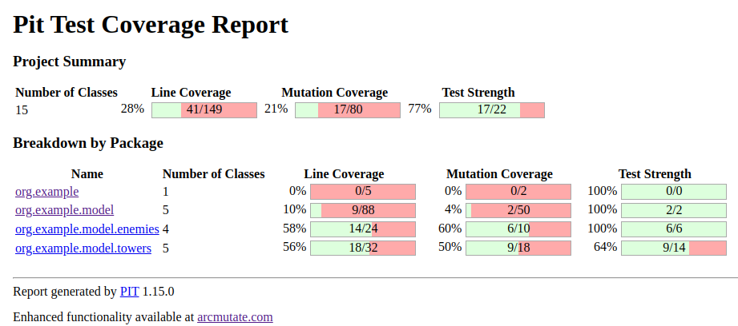
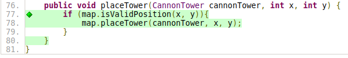
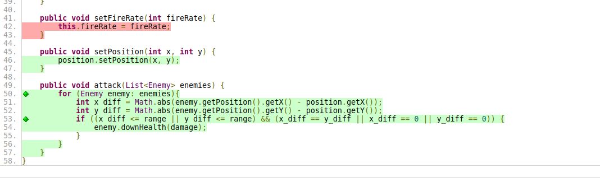
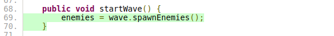

# Practica Calificada 4 - 2024-1

##### Enemigos

```java
public class Enemy {
    private int speed; // número de celdas por turno
    private int health;
    private int reward;
    private Position position;

    public Enemy(int speed, int health, int reward) {
        this.speed = speed;
        this.health = health;
        this.reward = reward;
        this.position = new Position(0, 0);
    }
    // Constructores, getters y setters
    public int getSpeed(){
        return this.speed;
    }
    public void setSpeed(int speed){
        this.speed = speed;
    }
    public int getHealth(){
        return this.health;
    }
    public void downHealth(int damage){
        this.health = this.health - damage;
    }
    public int getReward(){
        return this.reward;
    }
    public void setReward(int extra){
        this.reward = this.reward + extra;
    }
    public void setPosition(int x, int y) {
        position.setPosition(x, y);
    }
    public Position getPosition() {
        return this.position;
    }
}

public class BasicEnemy extends Enemy {
    public BasicEnemy() {
        super(1, 100, 10); // velocidad, vida, recompensa
    }
}

public class BossEnemy extends Enemy{
    public BossEnemy(){
        super(1, 500, 50);
    }
}

public class SpeedyEnemy extends Enemy {
    public SpeedyEnemy() {
        super(2, 45, 50);
    }
}
```

##### Torres

```java
public class Tower {
    private int damage;
    private int range;
    private int fireRate; // turnos entre disparos
    private Position position;

    public Tower(int damage, int range, int fireRate) {
        this.damage = damage;
        this.range = range;
        this.fireRate = fireRate;
        this.position =  new Position(0, 0);
    }
    // Constructores, getters y setters
    public int getDamage() {
        return this.damage;
    }

    public void setDamage(int damage) {
        this.damage = damage;
    }

    public int getRange() {
        return this.range;
    }

    public void setRange(int range) {
        this.range = range;
    }

    public int getFireRate() {
        return this.fireRate;
    }

    public void setFireRate(int fireRate) {
        this.fireRate = fireRate;
    }

    public void setPosition(int x, int y) {
        position.setPosition(x, y);
    }

    public void attack(List<Enemy> enemies) {
        for (Enemy enemy: enemies){
            int x_diff = Math.abs(enemy.getPosition().getX() - position.getX());
            int y_diff = Math.abs(enemy.getPosition().getY() - position.getY());
            if ((x_diff <= range || y_diff <= range) && (x_diff == y_diff || x_diff == 0 || y_diff == 0)) {
                enemy.downHealth(damage);
            }
        }
    }
}

public class CannonTower extends Tower {
    public CannonTower() {
        super(50, 2, 3); // daño, alcance, velocidad de disparo
    }
}

public class DartTower extends Tower{
    public DartTower(){
        super(20, 3, 1);
    }
}

public class LaserTower extends Tower{
    public LaserTower() {
        super(35, 4, 3);
    }
}

public class SniperTower extends Tower {
    public SniperTower() {
        super(50, 4, 4);
    }
}
```

##### Sistema de oleadas
```java
public class Wave {
    private List<Enemy> enemies;
    private int waveNumber;
    private Map map;

    public Wave(int waveNumber) {
        this.waveNumber = waveNumber;
        this.enemies = generateEnemies(waveNumber);
    }
    private List<Enemy> generateEnemies(int waveNumber) {
        List<Enemy> enemies = new ArrayList<>();
        for (int i = 0; i < waveNumber * 5; i++) { // más enemigos cada oleada
            enemies.add(new BasicEnemyFactory().createEnemy());
        }
        if (waveNumber % 5 == 0) { // jefe cada 5 oleadas
            enemies.add(new BossEnemyFactory().createEnemy());
        }
        if (waveNumber % 7 == 0) { // jefe cada 5 oleadas
            enemies.add(new SpeedyEnemyFactory().createEnemy());
        }
        return enemies;
    }
    // Métodos para manejar el progreso de la oleada
    public List<Enemy> spawnEnemies() {
        char[][] map = this.map.getMapGrid();

        List<Position> spawnPoints = new ArrayList<>();
        for (int i = 0; i < map.length; i++) {
            for (int j = 0; j < map[i].length; j++) {
                if (map[i][j] == 'C') {
                    spawnPoints.add(new Position(i, j));
                }
            }
        }
        for (Enemy enemy : enemies) {
            if (!spawnPoints.isEmpty()) {
                Position spawnPoint = spawnPoints.remove(0);
                this.map.placeEnemy(enemy, spawnPoint.getX(), spawnPoint.getY());
                System.out.println("Enemy spawned at (" + spawnPoint.getX() + ", " + spawnPoint.getY() + ")");
            } else {
                break;
            }
        }
        return enemies;
    }

    public List<Enemy> getEnemies() {
        return this.enemies;
    }

    public void setEnemies(List<Enemy> enemies){
        this.enemies = enemies;
    }

}
```

##### Sistema de puntuación

```java
public class Player {
    private int score;
    private int baseHealth;
    public Player() {
        this.score = 0;
        this.baseHealth = 100;
    }
    public void addScore(int points) {
        this.score += points;
    }
    public void deductBaseHealth(int damage) {
        this.baseHealth -= damage;
    }
    public int getScore() {
        return score;
    }
    public int getBaseHealth() {
        return baseHealth;
    }
}
```

### Interfaces y clases de Mocking:

- EnemyFactory: Interfaz para la creación de enemigos (concretas: BasicEnemyFactory, BossEnemyFactory).

```java
public interface EnemyFactory {
    Enemy createEnemy();
}

public class BasicEnemyFactory implements EnemyFactory {
    @Override
    public Enemy createEnemy() {
        return new BasicEnemy();
    }
}

public class SpeedyEnemyFactory implements EnemyFactory{
    @Override
    public Enemy createEnemy() {
        return new SpeedyEnemy();
    }
}

public class BossEnemyFactory implements EnemyFactory{
    @Override
    public Enemy createEnemy() {
        return new BossEnemy();
    }
}
```

- TowerFactory: Interfaz para la creación de torres (concretas: CannonTowerFactory, LaserTowerFactory).

```java
public interface TowerFactory {
    Tower createTower();
}

public class SniperTowerFactory implements TowerFactory{
    @Override
    public Tower createTower() {
        return new SniperTower();
    }
}

public class LaserTowerFactory implements TowerFactory{
    @Override
    public Tower createTower() {
        return new LaserTower();
    }
}

public class CannonTowerFactory implements TowerFactory {
    @Override
    public Tower createTower() {
        return new CannonTower();
    }
}

public class DartTowerFactory implements TowerFactory{
    @Override
    public Tower createTower() {
        return new DartTower();
    }
}
```

### Implementación de pruebas

#### Mocks:
- Utiliza Mockito para crear mocks de las clases Enemy y Tower para verificar la interacción entre objetos.

```java
@ExtendWith(MockitoExtension.class)
public class TowerAttackWithMocksTest {
    @Mock
    private Enemy enemyMock1;
    @Test
    public void testAttackInRange() {
        Tower tower = new Tower(10, 3, 1);
        // Posicion enemigo
        when(enemyMock1.getPosition()).thenReturn(new Position(1, 1));

        // Posición de la torre
        tower.setPosition(0, 0);
        tower.attack(List.of(enemyMock1));

        // Verificar que la salud del enemigo en rango se reduce
        verify(enemyMock1).downHealth(10);
    }

    @Mock
    private Enemy enemyMock2;
    @Test
    public void testAttackWithMocks() {
        Tower tower = new Tower(10, 3, 1);
        // Posicion enemigo
        when(enemyMock2.getPosition()).thenReturn(new Position(4, 4));

        // Posición de la torre
        tower.setPosition(0, 0);
        tower.attack(List.of(enemyMock2));

        // Verificar que la salud del enemigo fuera de rango no se reduce
        verify(enemyMock2, never()).downHealth(anyInt());
    }
}

```

#### Stubs:
- Crea stubs para métodos que devuelven enemigos o torres específicos.

```java
@ExtendWith(MockitoExtension.class)
public class EnemyFactoryTest {
    @Mock
    private EnemyFactory enemyFactoryMock;
    @Test
    public void testBasicEnemyFactory() {
        // Configurar stub
        when(enemyFactoryMock.createEnemy()).thenReturn(new BasicEnemy());
        Enemy createdEnemy = enemyFactoryMock.createEnemy();
        assertEquals(1, createdEnemy.getSpeed());
        assertEquals(100, createdEnemy.getHealth());
        assertEquals(10, createdEnemy.getReward());
        assertInstanceOf(BasicEnemy.class, createdEnemy);
    }

    @Test
    public void testBossEnemyFactory() {
        // Configurar stub
        when(enemyFactoryMock.createEnemy()).thenReturn(new BossEnemy());
        Enemy createdEnemy = enemyFactoryMock.createEnemy();
        assertEquals(1, createdEnemy.getSpeed());
        assertEquals(500, createdEnemy.getHealth());
        assertEquals(50, createdEnemy.getReward());
        assertInstanceOf(BossEnemy.class, createdEnemy);
    }

    @Test
    public void testSpeedyEnemyFactory() {
        // Configurar stub
        when(enemyFactoryMock.createEnemy()).thenReturn(new SpeedyEnemy());
        Enemy createdEnemy = enemyFactoryMock.createEnemy();
        assertEquals(2, createdEnemy.getSpeed());
        assertEquals(45, createdEnemy.getHealth());
        assertEquals(50, createdEnemy.getReward());
        assertInstanceOf(SpeedyEnemy.class, createdEnemy);
    }
}
```


```java
@ExtendWith(MockitoExtension.class)
public class TowerFactoryTest {
    @Mock
    private TowerFactory towerFactoryMock;
    @Test
    public void testDartFactory() {
        // Configurar stub
        when(towerFactoryMock.createTower()).thenReturn(new DartTower());
        Tower createdTower = towerFactoryMock.createTower();
        assertEquals(20, createdTower.getDamage());
        assertEquals(3, createdTower.getRange());
        assertEquals(1, createdTower.getFireRate());
        assertInstanceOf(DartTower.class, createdTower);
    }
    @Test
    public void testLaserFactory() {
        // Configurar stub
        when(towerFactoryMock.createTower()).thenReturn(new LaserTower());
        Tower createdTower = towerFactoryMock.createTower();
        assertEquals(35, createdTower.getDamage());
        assertEquals(4, createdTower.getRange());
        assertEquals(3, createdTower.getFireRate());
        assertInstanceOf(LaserTower.class, createdTower);
    }
    @Test
    public void testCannonFactory() {
        // Configurar stub
        when(towerFactoryMock.createTower()).thenReturn(new CannonTower());
        Tower createdTower = towerFactoryMock.createTower();
        assertEquals(50, createdTower.getDamage());
        assertEquals(2, createdTower.getRange());
        assertEquals(3, createdTower.getFireRate());
        assertInstanceOf(CannonTower.class, createdTower);
    }
    @Test
    public void testSniperFactory() {
        // Configurar mock para posición válida
        when(towerFactoryMock.createTower()).thenReturn(new SniperTower());
        Tower createdTower = towerFactoryMock.createTower();
        assertEquals(50, createdTower.getDamage());
        assertEquals(4, createdTower.getRange());
        assertEquals(4, createdTower.getFireRate());
        assertInstanceOf(SniperTower.class, createdTower);
    }
}
```

#### Fakes:
- Utilizar fakes para simular la base de datos de puntuación o estados de oleadas.


### Pruebas de mutación:
Implementa pruebas de mutación para verificar la calidad de las pruebas unitarias.


- ¿Qué herramienta utilizarías para realizar pruebas de mutación en este proyecto, y cómo la
configurarías?

Usaria Pitest ya que es la mas ideal para ver los posible mutantes en las pruebas: cuales son, cuales sobreviven y mueren. 

- Configura la herramienta de pruebas de mutación para el proyecto y ejecuta un análisis de
mutación en la clase TowerDefenseGame.

```
plugins {
    id 'java'
    id 'info.solidsoft.pitest' version '1.15.0'
    id 'jacoco' // Plugin de JaCoCo
}

group = 'org.example'
version = '1.0-SNAPSHOT'

repositories {
    mavenCentral()
}

dependencies {
    testImplementation 'org.junit.jupiter:junit-jupiter-api:5.8.2'
    testImplementation 'org.junit.jupiter:junit-jupiter-params:5.8.2'
    testRuntimeOnly 'org.junit.jupiter:junit-jupiter-engine:5.8.2'
    pitest 'org.pitest:pitest-junit5-plugin:1.1.0'
    testImplementation 'org.assertj:assertj-core:3.23.1'
    testImplementation 'org.mockito:mockito-inline:3.12.4'
    testImplementation 'org.mockito:mockito-junit-jupiter:3.12.4'
}

test {
    useJUnitPlatform()
}

// jacoco
jacoco {
    toolVersion = "0.8.12" // Versión de JaCoCo (compatible con java 21)
}

jacocoTestReport {
    dependsOn test // Ejecuta las pruebas antes de generar el informe

    reports {
        xml.required.set(true)
        html.required.set(true)
    }
}

check.dependsOn jacocoTestCoverageVerification

// ./gradlew pitest
// ./gradlew jacocoTestReport

pitest {
    targetClasses = ['org.example.*'] // Paquete de clases a mutar
    mutators = ['DEFAULTS'] // Conjunto de mutadores [OLD_DEFAULTS, DEFAULTS, STRONGER, ALL]
    outputFormats = ['HTML'] // Formato de salida del informe
    timestampedReports = false // Deshabilitar informes con marca de tiempo para facilitar la navegación
    verbose = true
}

// ./gradlew pitest
```



### Evaluación de cobertura de pruebas:

- ¿Cómo interpretarías los resultados de las pruebas de mutación y qué acciones tomarías para mejorar la cobertura de las pruebas?

Se tendria que hacer pruebas para las demas clases del programa y hacer tambien refactorizaciones para finalmente mejorar la cobertura.
Por ejemplo en Game se podria hacer estas pruebas:
```java
public class MapTest {
    @Test
    public void testPlaceTower_ValidPosition() {
        Map map = new Map();
        map.placeTower(new CannonTowerFactory().createTower(), 0, 0);
        assertTrue(map.isValidPosition(0, 3));
    }
    @Test
    public void testPlaceTower_NotOverrideHimself() {
        Map map = new Map();
        map.placeTower(new CannonTowerFactory().createTower(), 0, 0);
        assertFalse(map.isValidPosition(0, 0));
    }
    @Test
    public void testPlaceTower_InvalidPosition() {
        Map map = new Map();
        map.placeTower(new CannonTowerFactory().createTower(), -1, -1);
        assertTrue(map.isValidPosition(0, 3));
    }

    @Test
    public void testInvalidPositionForX() {
        Map map = new Map();
        assertFalse(map.isValidPosition(-1, 3));
    }

    @Test
    public void testInvalidPositionForY() {
        Map map = new Map();
        assertFalse(map.isValidPosition(0, -1));
    }

    @Test
    public void testInvalidPositionForTower() {
        Map map = new Map();
        assertFalse(map.isValidPosition(0, 2));
    }

    @Test
    public void testValidPosition() {
        Map map = new Map();
        assertTrue(map.isValidPosition(0, 0));
    }

    @Test
    public void testGridSize() {
        Map map = new Map();
        char[][] grid = map.getMapGrid();
        assertEquals(5, grid.length);
    }
}
```


Se puede ver que la cobertura aumenta:


- Implementa mejoras en las pruebas unitarias basándote en los resultados de las pruebas de mutación y explica las razones de cada cambio.

En las siguientes preguntas se haran nuevas pruebas y estas cubriran y mejoraran la cobertura de las pruebas, se indicara como va cambiando la cobertura a lo largo de las pruebas.

### Preguntas de diseño e implementación (5 puntos)

##### Diseño de la clase Map:
- ¿Cómo implementarías la clase Map para representar el mapa del juego, asegurando que se
puedan agregar y verificar posiciones de torres y caminos?

```java
public class Map {
    final int DIM = 5;
    private int rows;
    private int columns;
    private char[][] mapGrid;
    private List<Position> road;

    public Map(int rows, int columns){
        this.rows = DIM;
        this.columns = DIM;
        this.mapGrid = new char[][] {
                {' ', ' ', 'C', ' ', ' '},
                {' ', 'C', ' ', ' ', ' '},
                {'C', ' ', ' ', 'C', 'B'},
                {' ', ' ', 'C', ' ', ' '},
                {' ', ' ', ' ', ' ', ' '}
        };
        generateRoad();

    }

    public void generateRoad() {
    
        this.road = List.of(new Position(2,0),
                new Position(1,1),
                new Position(0,2),
                new Position(3,1),
                new Position(3,2),
                new Position(2,3),
                new Position(2, 4)
        );
    }

    public List<Position> getRoad(){
        return this.road;
    }

    public void printMap(){
        for (int i = 0; i < rows; i++) {
            for (int j = 0; j < columns; j++) {
                String mapElement = "[" + mapGrid[i][j] + "]";
                System.out.print(mapElement);
            }
            System.out.println();
        }
    }

    public boolean isValidPosition(int x, int y){
        return (x > 0 && x < rows) && (y > 0 && y < columns) && mapGrid[x][y] == ' ;
    }

    public void placeEnemy(Enemy any, int x, int y) {
        mapGrid[x][y] = 'E';
    }

    public void placeTower(Tower any, int x, int y) {
        mapGrid[x][y] = 'T';
    }

    public void placeEnemy(Enemy enemy, int x, int y) {
        mapGrid[x][y] = 'E';
        enemy.setPosition(x, y);
    }

    public void placeRoad(int x, int y) {
        mapGrid[x][y] = 'C';
    }

    public void placeTower(Tower tower, int x, int y) {
        mapGrid[x][y] = 'T';
        tower.setPosition(x, y);
    }

    public boolean checkTower(int i,int j){
        return mapGrid[i][j] == 'T';
    }

    public boolean checkEnemy(int i,int j){
        return mapGrid[i][j] == 'E';
    }

    public boolean checkRoad(int i,int j){
        return mapGrid[i][j] == 'C';
    }

    public boolean checkPlace(int i,int j){
        return mapGrid[i][j] == 'B';
    }
}
```

- Implementa un método en la clase Map llamado isValidPosition(int x, int y) que verifique si
una posición es válida para colocar una torre.

```java
public boolean isValidPosition(int x, int y){
   return (x > 0 && x < rows) && (y > 0 && y < columns) && mapGrid[x][y] == 0;
}
```

##### Enemigos con diferentes características:
- Diseña e implementa una clase SpeedyEnemy que herede de Enemy y tenga una velocidad
mayor pero menos vida.

```java
public class SpeedyEnemy extends Enemy {
    public SpeedyEnemy() {
        super(2, 45, 50);
    }
}
```

- ¿Cómo gestionarías el movimiento de los enemigos en el mapa, asegurando que sigan el camino predefinido?

```java
public void moveEnemies(){
        for (Enemy enemy: enemies){
            Position initialPos = enemy.getPosition();
            int positionIndex = getPositionIndex(initialPos.getX(), initialPos.getY());
            Position newPosition = map.getRoad().get(positionIndex+1);
            map.placeEnemy(enemy, newPosition.getX(), newPosition.getY());
            map.placeRoad(initialPos.getX(), initialPos.getY());
        }
}
```

#### Torres con diferentes habilidades:
- Implementa una clase SniperTower que tenga un daño alto y un alcance muy largo pero una velocidad de disparo baja.

```java
public class SniperTower extends Tower {
    public SniperTower() {
        super(50, 4, 4);
    }
}
```

- ¿Cómo implementarías el método attack(List<Enemy> enemies) en la clase Tower para atacar a los enemigos dentro de su alcance?

```java
public void attack(List<Enemy> enemies) {
        for (Enemy enemy: enemies){
            int x_diff = Math.abs(enemy.getPosition().getX() - position.getX());
            int y_diff = Math.abs(enemy.getPosition().getY() - position.getY());
            if ((x_diff <= range || y_diff <= range) && (x_diff == y_diff || x_diff == 0 || y_diff == 0)) {
                enemy.downHealth(damage);
            }
        }
}
```

#### Sistema de oleadas:
- ¿Cómo diseñarías la generación de oleadas para que cada oleada sea progresivamente más difícil?

Al metodo generateEnemies() le añadiria una condicional adicional tal que a mayor numero de enemigos por lo tanto la dificultad del juego sube.

```java
public class Wave {
    private List<Enemy> enemies;
    private int waveNumber;
    public Wave(int waveNumber) {
        this.waveNumber = waveNumber;
        this.enemies = generateEnemies(waveNumber);
    }
    private List<Enemy> generateEnemies(int waveNumber) {
        List<Enemy> enemies = new ArrayList<>();
        for (int i = 0; i < waveNumber * 5; i++) { // más enemigos cada oleada
            enemies.add(new BasicEnemyFactory().createEnemy());
        }
        if (waveNumber % 5 == 0) { // jefe cada 5 oleadas
            enemies.add(new BossEnemyFactory().createEnemy());
        }
        if (waveNumber % 7 == 0) { // enemigo veloz cada 5 oleadas
            enemies.add(new SpeedyEnemyFactory().createEnemy());
        }
        return enemies;
    }
}
```

- Implementa un método en la clase Wave llamado spawnEnemies() que genere los enemigos de la oleada y los coloque en el mapa.

```java
    public List<Enemy> spawnEnemies() {
        char[][] map = this.map.getMapGrid();

        List<Position> spawnPoints = new ArrayList<>();
        for (int i = 0; i < map.length; i++) {
            for (int j = 0; j < map[i].length; j++) {
                if (map[i][j] == 'C') {
                    spawnPoints.add(new Position(i, j));
                }
            }
        }
        for (Enemy enemy : enemies) {
            if (!spawnPoints.isEmpty()) {
                Position spawnPoint = spawnPoints.remove(0);
                this.map.placeEnemy(enemy, spawnPoint.getX(), spawnPoint.getY());
                System.out.println("Enemy spawned at (" + spawnPoint.getX() + ", " + spawnPoint.getY() + ")");
            } else {
                break;
            }
        }
        return enemies;
    }
```

#### Sistema de puntuación y salud de la base:

- ¿Cómo actualizarías la puntuación del jugador y la salud de la base cuando un enemigo es derrotado o alcanza la base?

Si el enemigo es derrotado entonces se nos tendria que adicionar los puntos que corresponden dependiendo del tipo de enemigo derrotado y la salud se decrementaria en caso el enemigo nos ataca, esto depende del tipo de enemigo ya que cada tipo de estos decrementa cierto valor.

```java
public class Game {
    public boolean isEnemyDied(Enemy enemy){
        return enemy.getHealth()<=0;
    }

    public void moveEnemies(){
        for (Enemy enemy: enemies){
            if (isEnemyDied(enemy)){
                enemies.remove(enemy);
                player.updateScoreAndHealth(enemy, true);
            }
            Position initialPos = enemy.getPosition();
            int positionIndex = getPositionIndex(initialPos.getX(), initialPos.getY());
            Position newPosition = map.getRoad().get(positionIndex+1);
            if (newPosition == map.getBase()){
                enemies.remove(enemy);
                player.updateScoreAndHealth(enemy, false);
            } else {
                map.placeEnemy(enemy, newPosition.getX(), newPosition.getY());
                map.placeRoad(initialPos.getX(), initialPos.getY());
            }
        }
    }
}
```

- Implementa un método en la clase Player llamado updateScoreAndHealth(Enemy enemy, boolean defeated).

```java
public void updateScoreAndHealth(Enemy enemy, boolean defeated){
        if (defeated) {
            this.addScore(enemy.getReward());
        } else {
            this.deductBaseHealth(25);
        }
}
```

## Pruebas estructurales (3 puntos)

#### Cobertura de ramas:

- Ejercicio: Implementa pruebas para garantizar que todas las ramas del método placeTower en la clase TowerDefenseGame estén cubiertas

```java
@ExtendWith(MockitoExtension.class)
public class TowerDefenseGameTest {
    // tests 1
    @Mock
    private Map mockMap;
    // tests 2
    @Mock
    private Wave mockWave;
    @InjectMocks
    private Game game;
    @Test
    public void testPlaceTower_ValidPosition() {
        // Configurar mock para posición válida
        when(mockMap.isValidPosition(3, 4)).thenReturn(true);
        game.placeTower(new CannonTower(), 3, 4);
        // Verificar que la torre se haya colocado
        verify(mockMap).placeTower(any(Tower.class), eq(3), eq(4));
    }
    @Test
    public void testPlaceTower_InvalidPosition() {
        // Configurar mock para posición inválida
        when(mockMap.isValidPosition(3, 4)).thenReturn(false);
        game.placeTower(new CannonTower(), 3, 4);
        // Verificar que la torre no se haya colocado
        verify(mockMap, never()).placeTower(any(Tower.class), eq(3), eq(4));
    }
}
```



#### Cobertura de condiciones:

- Ejercicio: Escribe pruebas unitarias para verificar todas las condiciones en el método attack
de la clase Tower.

```java
public class TowerAttackGameTest {

    @Test
    public void testAttackVertical_EnemyInRange() {
        List<Enemy> enemies = Arrays.asList(new BasicEnemy());
        enemies.get(0).setPosition(2, 2);
        Tower tower = new CannonTower();
        tower.setPosition(2, 1);
        tower.attack(enemies);
        // Verificar que el enemigo ha recibido daño
        assertEquals(50, enemies.get(0).getHealth());
    }

    @Test
    public void testAttack_HorizontalEnemyInRange() {
        List<Enemy> enemies = Arrays.asList(new BasicEnemy());
        enemies.get(0).setPosition(2, 2);
        Tower tower = new CannonTower();
        tower.setPosition(3, 2);
        tower.attack(enemies);
        // Verificar que el enemigo ha recibido daño
        assertEquals(50, enemies.get(0).getHealth());
    }

    @Test
    public void testAttack_EnemyOutOfRange() {
        List<Enemy> enemies = Arrays.asList(new BasicEnemy());
        enemies.get(0).setPosition(5, 5);
        Tower tower = new CannonTower();
        tower.setPosition(2, 1);
        tower.attack(enemies);
        // Verificar que el enemigo no ha recibido daño
        assertEquals(100, enemies.get(0).getHealth());
    }

    @Test
    public void testAttack_DiagonalEnemyInRange() {
        List<Enemy> enemies = Arrays.asList(new BasicEnemy());
        enemies.get(0).setPosition(3, 0);
        Tower tower = new CannonTower();
        tower.setPosition(2, 1);
        tower.attack(enemies);
        // Verificar que el enemigo ha recibido daño
        assertEquals(50, enemies.get(0).getHealth());
    }

    @Test
    public void testAttack_InRangeButNoDiagonal() {
        List<Enemy> enemies = Arrays.asList(new BasicEnemy());
        enemies.get(0).setPosition(3, 1);
        Tower tower = new CannonTower();
        tower.setPosition(0, 0);
        tower.attack(enemies);
        // Verificar que el enemigo no ha recibido daño
        assertEquals(100, enemies.get(0).getHealth());
    }
}
```



#### Cobertura de rutas:

- Ejercicio: Implementa pruebas para cubrir todos los caminos posibles en el método
startWave de la clase TowerDefenseGame.

```java
 @Mock
 private Wave mockWave;
 @InjectMocks
 private Game game;
 @Test
    public void testStartWave_WithEnemies() {
        when(mockWave.spawnEnemies()).thenReturn(Arrays.asList(new BasicEnemy()));
        game.startWave();
        // Verificar que los enemigos han sido generados y la oleada ha comenzado
        assertFalse(game.getEnemies().isEmpty());
    }

    @Test
    public void testStartWave_NoEnemies() {
        when(mockWave.spawnEnemies()).thenReturn(Collections.emptyList());
        game.startWave();
        // Verificar que no se han generado enemigos
        assertTrue(game.getEnemies().isEmpty());
    }
```




## Preguntas de pruebas con Mockito (2 puntos)

#### Mocking de dependencias:
- ¿Cómo usarías Mockito para crear un mock del Map y probar la colocación de torres en la clase TowerDefenseGame?

```java
@ExtendWith(MockitoExtension.class)
public class TowerDefenseGameTest {
    // tests 1
    @Mock
    private Map mockMap;
    // tests 2
    @Mock
    private Wave mockWave;
    @InjectMocks
    private Game game;
    @Test
    public void testPlaceTower_ValidPosition() {
        // Configurar mock para posición válida
        when(mockMap.isValidPosition(3, 4)).thenReturn(true);
        game.placeTower(new CannonTower(), 3, 4);
        // Verificar que la torre se haya colocado
        verify(mockMap).placeTower(any(Tower.class), eq(3), eq(4));
    }
}
```

- Implementa un test con Mockito para verificar que el método placeTower solo permite colocar torres en posiciones válidas del mapa.

```java
@ExtendWith(MockitoExtension.class)
public class TowerDefenseGameTest {
    // tests 1
    @Mock
    private Map mockMap;
    // tests 2
    @Mock
    private Wave mockWave;
    @InjectMocks
    private Game game;
    @Test
    public void testPlaceTower_InvalidPosition() {
        // Configurar mock para posición inválida
        when(mockMap.isValidPosition(3, 4)).thenReturn(false);
        game.placeTower(new CannonTower(), 3, 4);
        // Verifica que no permite colocar torres en posiciones invaludas
        verify(mockMap, never()).placeTower(any(Tower.class), eq(3), eq(4));
    }
}
```

#### Stubbing de métodos:
- ¿Cómo usarías stubs en Mockito para simular el comportamiento del método getEnemies en la clase Wave durante las pruebas?

```java
@ExtendWith(MockitoExtension.class)
public class WaveTest {
    @Mock
    private Wave waveMock;
    @Test
    public void testGetEnemies() {
        // Arrange
        when(waveMock.getEnemies()).thenReturn(Arrays.asList(new SpeedyEnemy(), new SpeedyEnemy(), new SpeedyEnemy(), new SpeedyEnemy(), new SpeedyEnemy()));
        // Act
        List<Enemy> enemies = waveMock.getEnemies();
        // Assert
        assertEquals(5, enemies.size());
    }
}
```

- Implementa un test que use un stub para verificar el comportamiento del método startWave en la clase TowerDefenseGame.

```java
@ExtendWith(MockitoExtension.class)
public class TowerDefenseGameTest {
    @Mock
    private Map mockMap;
    @Mock
    private Wave mockWave;
    @InjectMocks
    private Game game;
    @Test
    public void testStartWave_WithEnemiesList() {
        when(mockWave.spawnEnemies()).thenReturn(Arrays.asList(new BasicEnemy(), new BasicEnemy(), new BasicEnemy()));
        game.startWave();
        // Verificar que los enemigos han sido generados y la oleada ha comenzado
        assertEquals(3, game.getEnemies().size());
    }
}
```
